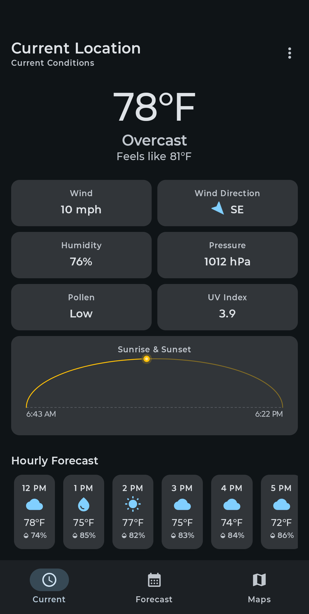
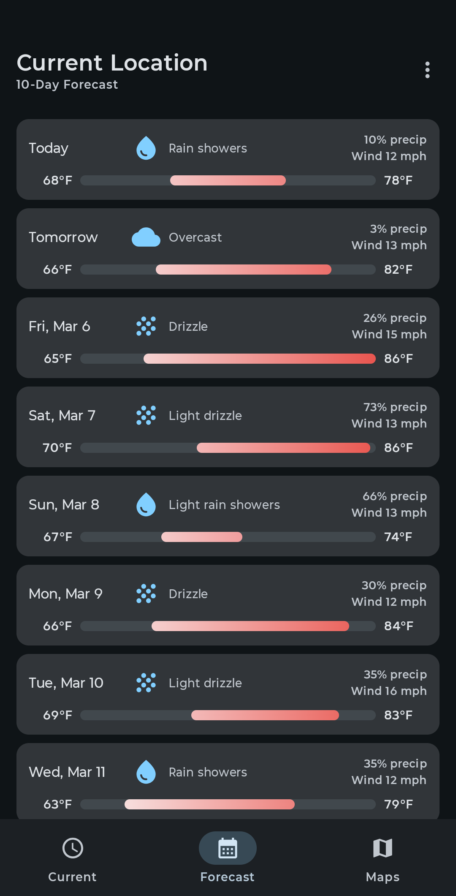
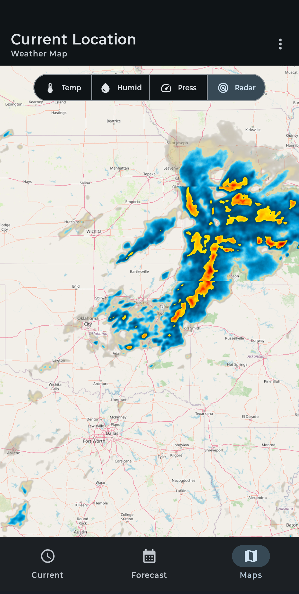

# Zephyrus

<p align="center">
  
</p>

A modern, native Android weather app built with Kotlin and Jetpack Compose.

## About the Name

In Greek mythology, **Zephyrus** (Ζέφυρος) is the god of the west wind — the gentlest and most favorable of the winds. Ancient Greeks associated Zephyrus with the arrival of spring and fair weather. This app carries his name as a nod to that connection between wind, weather, and the changing seasons.

## Screenshots

<p align="center">
  
  &nbsp;&nbsp;
  
  &nbsp;&nbsp;
  
</p>

## Features

- **Current Conditions** — Temperature, wind, humidity, pressure, UV index, precipitation, and descriptive weather indicators (sunny, cloudy, rain, snow, fog, etc.)
- **Hourly Forecast** — At least 8 hours of hourly forecast data, extending into the next day when needed
- **10-Day Forecast** — Extended forecast with daily highs/lows, humidity, wind, and weather conditions
- **Interactive Weather Maps** — Temperature, humidity, pressure overlays and Doppler radar imagery on OpenStreetMap tiles with color legends and viewport-aware data loading
- **Location Search** — Search by city name, zip code, or airport code; save favorite locations for quick access
- **Device Location** — Automatically detects your current location via GPS
- **Units** — Toggle between Fahrenheit and Celsius

## Tech Stack

- **Language:** Kotlin
- **UI:** Jetpack Compose with Material 3
- **Architecture:** MVVM (ViewModel + StateFlow + Repository)
- **DI:** Hilt
- **Networking:** Retrofit 3 + OkHttp with coroutine-based exponential backoff retry
- **Maps:** osmdroid with OpenStreetMap tiles
- **Local Storage:** Room (saved locations), DataStore (user preferences)
- **Build:** Android Gradle Plugin 9.0, Gradle 9.3

## Weather Data

All weather data is provided by [Open-Meteo](https://open-meteo.com/) — a free, open-source weather API that requires no API key. Data is sourced from national weather services. Currently optimized for United States locations, with international support planned for the future.

Radar imagery is provided by [RainViewer](https://www.rainviewer.com/) — a free radar data API with global Doppler radar coverage.

Map tiles are provided by [OpenStreetMap](https://www.openstreetmap.org/copyright) contributors.

## AI-Assisted Development

This application was developed with extensive assistance from AI (GitHub Copilot). The architecture, implementation, debugging, and code review were performed collaboratively between a human developer and AI. While care has been taken to produce quality code, users should be aware of this development approach.

## Disclaimer

**This software is provided "as is", without warranty of any kind, express or implied.** There are no warranties of merchantability, fitness for a particular purpose, or noninfringement. The authors and contributors are not liable for any claim, damages, or other liability arising from the use of this software. Weather data accuracy depends on third-party sources and should not be relied upon for safety-critical decisions. See the [LICENSE](LICENSE) file for full terms.

## License

This project is licensed under the [MIT License](LICENSE).

## Building

```bash
./gradlew assembleDebug
```

Requires Android Studio with JDK 21 and Android SDK installed.
